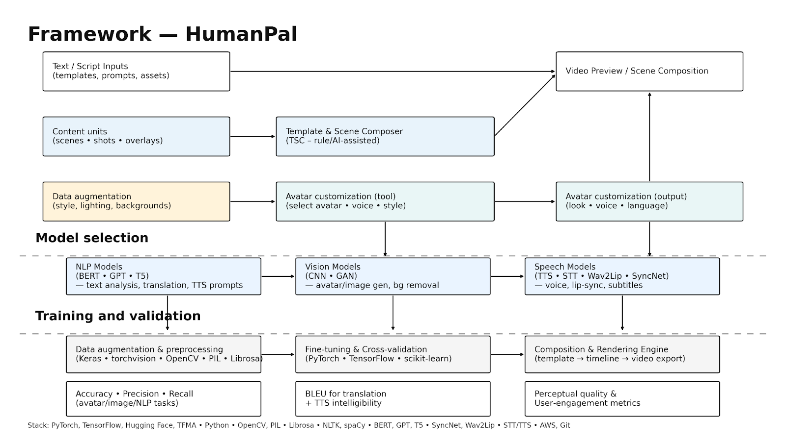
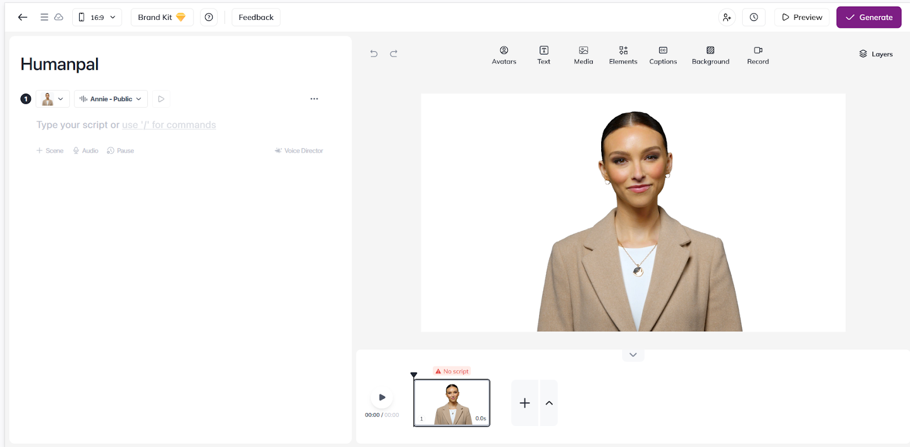
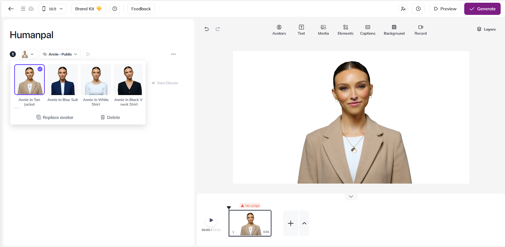
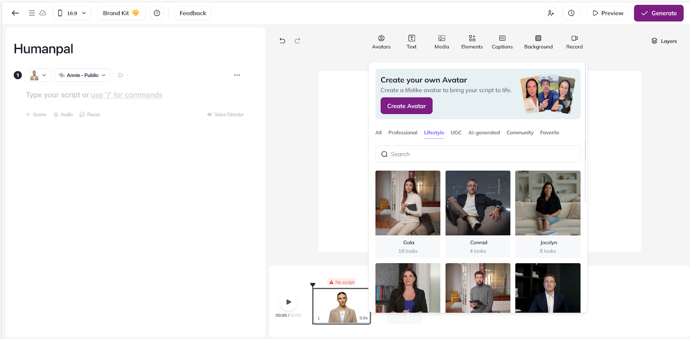
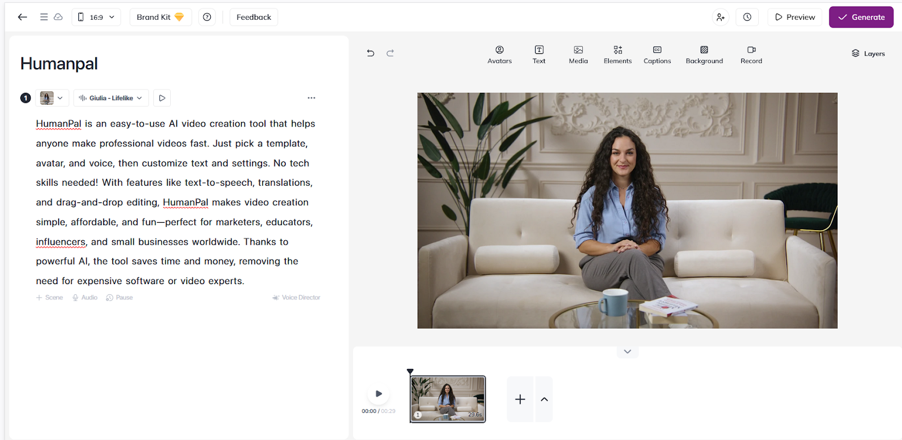
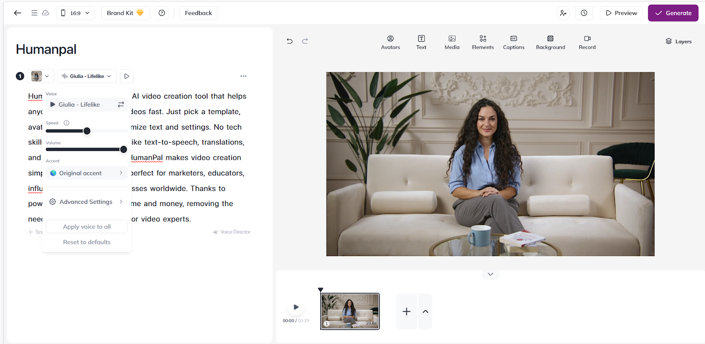
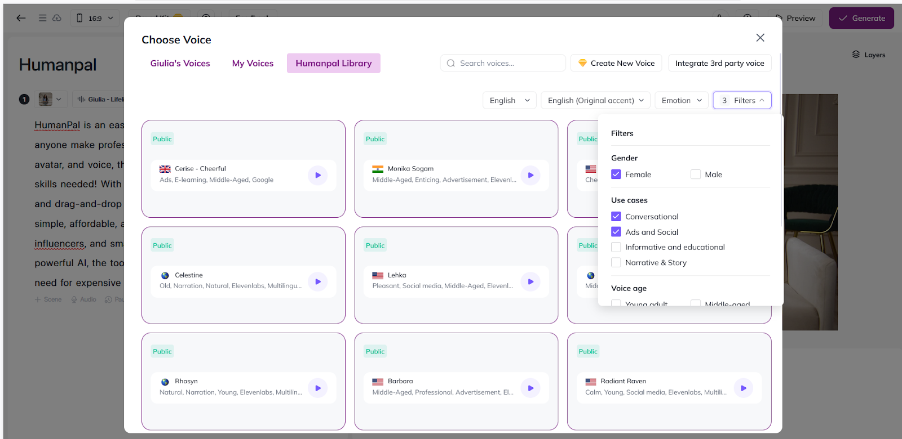

# 🎬 HumanPal – AI-Powered Video Creation Platform

**HumanPal** is an **easy-to-use AI video creation tool** that empowers anyone to make professional videos quickly. Just pick a template, avatar, and voice, then customize text and settings—no technical skills required!

With **text-to-speech**, multilingual translation, and drag‑and‑drop editing, HumanPal simplifies video creation for **marketers, educators, influencers, and small businesses worldwide**.

---

## 🗂 Scheme

---

## 🔹 Overview
HumanPal enables creators to produce **personalized, high-quality videos** effortlessly:
- Choose video type, template, avatar, and voice
- Customize text positions and settings
- Export in multiple formats for seamless sharing

It bridges creativity and technology, making video creation **accessible, affordable, and fun** for all skill levels.

---

## Examples

<table>
    <tbody>
        <tr>
            <td>
                
            </td>
            <td>
                
            </td>
        </tr>
        <tr>
            <td>
                
            </td>
            <td>
                
            </td>
        </tr>
        <tr>
            <td>
                
            </td>
            <td>
                
            </td>
        </tr>
        <tr>
            <td>
                
            </td>
            <td>
                
            </td>
        </tr>
        <tr>
            <td>
                
            </td>
        </tr>
    </tbody>
</table>

---

## 🎥 Video Examples

<table>
    <tbody>
        <tr>
            <td>
                <video src="https://github.com/user-attachments/assets/1b429e34-dcbd-467f-a068-6284ae75aa01" controls preload>
                    Your browser does not support the video tag.
                </video>
            </td>
            <td>
                <video src="https://github.com/user-attachments/assets/5548645e-81f9-4686-9fd6-ab11d76cf8e5" controls preload>
                    Your browser does not support the video tag.
                </video>
            </td>
        </tr>
        <tr>
            <td>
                <video src="https://github.com/user-attachments/assets/2300075a-fb2f-4c94-a445-c201704d045b" controls preload>
                    Your browser does not support the video tag.
                </video>
            </td>
            <td>
                <video src="https://github.com/user-attachments/assets/2c441664-4b58-4134-a457-985b9da46636" controls preload>
                    Your browser does not support the video tag.
                </video>
            </td>
        </tr>
        <tr>
            <td>
                <video src="https://github.com/user-attachments/assets/2909afdf-697c-4de7-bfd0-81ca915ce70f" controls preload>
                    Your browser does not support the video tag.
                </video>
            </td>
            <td></td>
        </tr>
    </tbody>
</table>

<table>
    <tbody>
        <tr>
            <td width="50%">
                <video src="https://github.com/user-attachments/assets/11ba8d69-d52c-4533-b03d-dd3ca700eb93" controls preload>
                    Your browser does not support the video tag.
                </video>
            </td>
            <td></td>
        </tr>
    </tbody>
</table>

---

## 📖 Full Description

  
📖 Click to expand the Description

### ❌ Problem
- High demand for engaging video content across industries
- Non-technical users struggle with complex video editing tools
- Limited budgets and time prevent consistent content creation
- Traditional production is costly and time-consuming

These challenges hinder creators from **producing high-quality content regularly**, affecting audience engagement and reach.

---

### ✅ Solution
- Step-by-step, user-friendly interface guides creators through video production
- Ready-made templates reduce complex design decisions
- Drag-and-drop editing for **easy element arrangement**
- AI-powered automation saves time, allowing creators to **focus on storytelling**
- Multilingual support and 1-click translation expands global reach
- Text-to-speech & speech-to-text for **voiceovers and subtitles**

**Outcome:** creators can produce engaging, professional videos **without technical expertise**.

---

### 🛠️ Process

#### 1️⃣ Pre-processing
- **Image Processing:** OpenCV, PIL for manipulation, background removal, enhancement
- **Speech Processing:** TensorFlow Audio, Librosa for noise reduction, voice normalization
- **Text Analysis:** NLTK, spaCy for tokenization, lemmatization, sentiment analysis

#### 2️⃣ Model Selection
- **CNNs:** TensorFlow & PyTorch for image generation and manipulation
- **NLP Models:** Transformers (BERT, GPT, T5) for TTS, translations, and text analysis
- **GANs:** TensorFlow & PyTorch for AI Human Photo Generator

#### 3️⃣ Training & Validation
- Deep learning frameworks: TensorFlow, PyTorch
- Data augmentation for robustness
- Cross-validation with scikit-learn modules

#### 4️⃣ Evaluation Metrics
- **Accuracy, Precision, Recall:** classification tasks
- **BLEU Score:** translation quality
- **Perceptual Metrics:** image quality assessment

---

### 🏆 Achievements
- 🚀 **40% increase** in creators using the platform
- ⏱️ **25% faster** video production efficiency
- 💰 **20% cost reduction** in video production
- 📈 **35% higher content consistency**
- 👍 **30% boost** in audience engagement
- 🌍 **25% increase** in global market reach through multilingual support

---

### 🔮 Future Improvements
1. **Advanced AI Integration:** More realistic avatars via deep learning models
2. **Enhanced Collaboration:** Real-time teamwork with WebSocket & WebRTC
3. **Expanded Template Library:** AI-driven recommendations for creative themes
4. **Global Language Support:** Multilingual TTS and translation for worldwide audiences
5. **Community & Marketplace Expansion:** Collaborative platform for sharing and monetizing content

---

### 🧰 Tools & Technologies
- **Frameworks:** PyTorch, TensorFlow, Hugging Face, TFMA
- **Languages:** Python
- **Libraries:** OpenCV, PIL, Syncnet, Wav2Lip, Librosa, NLTK, spaCy
- **AI Models:** BERT, GPT, T5
- **Platforms:** AWS, Git
- **Technologies:** TTS, STT, GANs, CNNs, NLP

---

### 📚 References
1. [arXiv.org](https://arxiv.org)
2. NeurIPS Proceedings
3. ICML Proceedings
4. IEEE Transactions on Pattern Analysis and Machine Intelligence (PAMI)
5. MIT Technology Review
6. DeepMind Blog
7. OpenAI Blog
8. Google AI Blog
9. Nature Machine Intelligence
10. Towards Data Science

